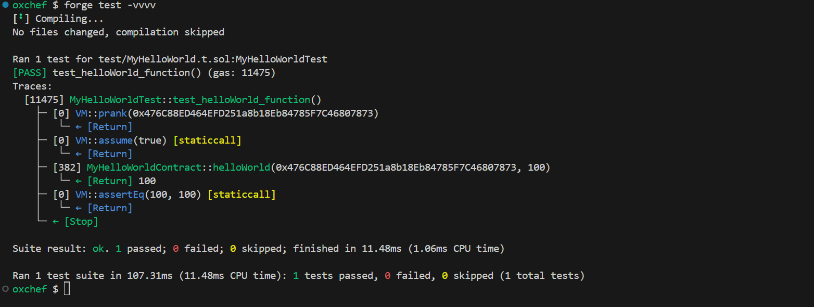
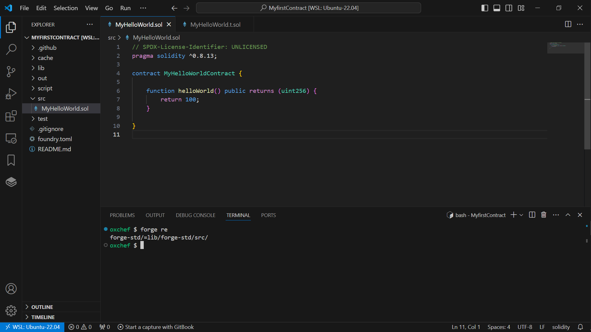
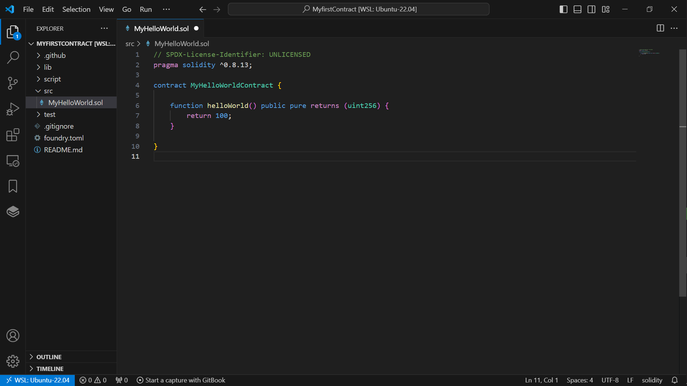
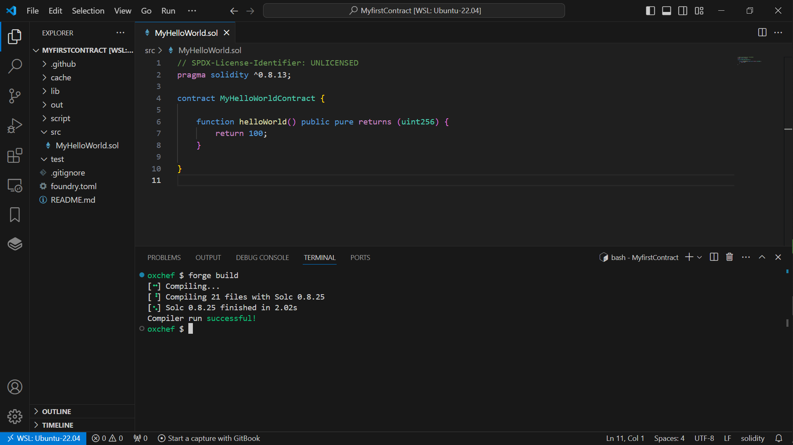
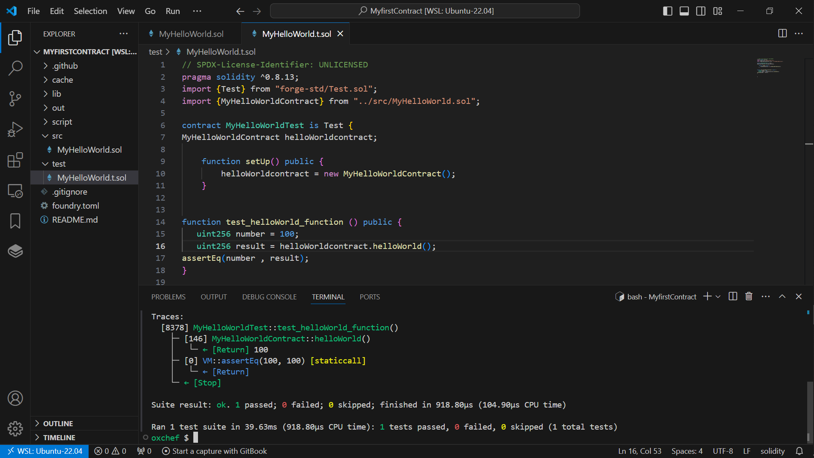

# Development 

To get started, we will learn solidity as a language.
Let’s create a hello world using foundry.

```solidity

contract MyHelloWorldContract {

	function helloWorld() public pure returns (uint256) {
		return 100;
	}
}
```

First we need to make sure  we have foundry installed .

Open your terminal and run the following command:
```bash
curl -L https://foundry.paradigm.xyz | bash
```

>[!NOTE]
> If you’re on Windows, you will need to install and use Git BASH or WSL, as your terminal


This will install Foundryup, then simply follow the instructions on-screen, which will make the foundryup command available in your CLI

After installation , Lets run the  command below  in terminal  to creates a new directory `MyfirstContract`   using foundry default template and  also initialize a new git repository

```bash
forge init MyfirstContract --no-commit
```

>[!NOTE]
>Forge is a command-line tool that >ships with Foundry. Forge tests, builds, and deploys your smart contracts
>Your Project Directory should look like this .





#### Project Layout

We can see that some starter files has been downloaded in our workspace. Lets walkthrough : 

 1. The `/lib` folder is where all  downloaded libraries  will be stored. (dependencies are stored as git submodules)

 2. The  `/script` folder is where we will be writing our deploy script.

 3. The `/src` folder is where we will be writing our contract (default directory for contracts)

 4. The `/test` folder is where we will be writing test for all the contracts.(default directory for tests)

We can also see that there are files inside these folders with `.sol` extentions.  These files are solidity files
 


#### Imports 

We can run below command to see how forge is  mapping out  dependencies ;

```bash
forge re
```
or 

```bash
forge remappings
```



forge-std/ can be found(=) or (maps to ) in the lib/forge-std/src/ directory 

We can now craft our import statement as follows

```bash
import "forge-std/Test.sol"
```

We can also import contracts buy crafting the statement 
Assuuming we want to import our MyfirstContract contract 

```bash
import {MyHelloWorldContract} from "../src/MyHelloWorld.sol";
```





To compile the code we run the following command :

```bash
forge build  
```




#### Testing


The test code should look something like this 

```solidity
// SPDX-License-Identifier: UNLICENSED
pragma solidity ^0.8.13;
import {Test} from "forge-std/Test.sol";
import {MyHelloWorldContract} from "../src/MyHelloWorld.sol";

contract MyHelloWorldTest is Test {
MyHelloWorldContract helloWorldcontract;

    function setUp() public {
        helloWorldcontract = new MyHelloWorldContract();
    }


function test_helloWorld_function () public {
   uint256 number = 100;
   uint256 result = helloWorldcontract.helloWorld();
assertEq(number , result);
}


}
```

>[!NOTE]
>You noitced that the test contract  ends with .t.sol

Now  copy or type the code in the new file created in the `/test` folder and run the command :

To run all test incase we have multiple function :

```bash
forge test 
```

Since we only have a single function and we want to  run only that, we can use the command :

```bash
forge test --mt  test_helloWorld_function 
```
This  will look search inside your project  for a test function called `test_helloWorld_function`
Remember to add `test` before your function name this is becuase  contract with a function that starts with test is considered to be a test. 
In the our case  we added `test` to `_helloWorld_function`  .


To display output add flag -vvvv :
```bash
forge test --mt  test_helloWorld_function -vvvv
```

We can also run 
```bash 
forge test --match-contract MyHelloWorldTest --match-test test_helloWorld_function
```
to specifically  call the `test_helloWorld_function` in the `MyHelloWorldTest` contract





